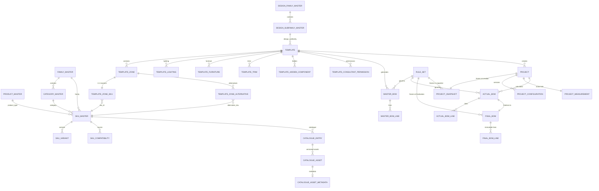

# PERFECCITY MVP – Entity-Relationship Diagram

## Mermaid Diagram

## Key Invariants

- **One Zone = One SKU** – Enforced by `UNIQUE (zone_id)` on `template_zone_sku`
- **Snapshot Immutability** – Trigger prevents UPDATE/DELETE on `project_snapshot`
- **Final BOM Immutability** – Trigger prevents UPDATE/DELETE on `final_bom` and `final_bom_line`
- **Audit Append-Only** – Trigger prevents UPDATE/DELETE on `audit_event`

## Table Summary (34 tables)

### Master Data (5)
- `product_master` – Three product types
- `family_master` – Product families
- `category_master` – Categories under families
- `design_family_master` – Design classification vocabulary
- `design_subfamily_master` – Child design classifications

### SKU Management (3)
- `sku_master` – All SKU definitions
- `sku_variant` – Variant groupings
- `sku_compatibility` – Compatibility rules between SKUs

### Product Catalogue (3)
- `catalogue_entry` – Catalogue entries per SKU
- `catalogue_asset` – Versioned assets (geometry, pattern, render)
- `catalogue_asset_metadata` – Validated dimensions

### Rule Engine (1)
- `rule_set` – Calculation constants and rules

### Template & Design (8)
- `template` – Reusable design definitions
- `template_zone` – Zone geometry within templates
- `template_zone_sku` – Primary SKU per zone (1:1)
- `template_zone_alternative` – Promoted alternatives
- `template_lighting` – Lighting configurations
- `template_furniture` – Furniture placements
- `template_trim` – Trim definitions
- `template_hidden_component` – Hidden construction components
- `template_consultant_permission` – Consultant permission rules

### BOM (Master) (2)
- `master_bom` – System-generated BOM per template
- `master_bom_line` – Individual BOM lines

### Project (4)
- `project` – Project instances
- `project_snapshot` – Immutable frozen template state
- `project_configuration` – Versioned consultant configurations
- `project_measurement` – Actual site measurements

### BOM (Actual) (2)
- `actual_bom` – Calculated BOM per project
- `actual_bom_line` – Actual BOM detail lines

### BOM (Final) (2)
- `final_bom` – Immutable finalised BOM
- `final_bom_line` – Denormalised immutable lines

### System (3)
- `audit_event` – Append-only audit trail
- `project_idempotency` – Project creation idempotency keys
- `finalization_idempotency` – Finalisation idempotency keys
